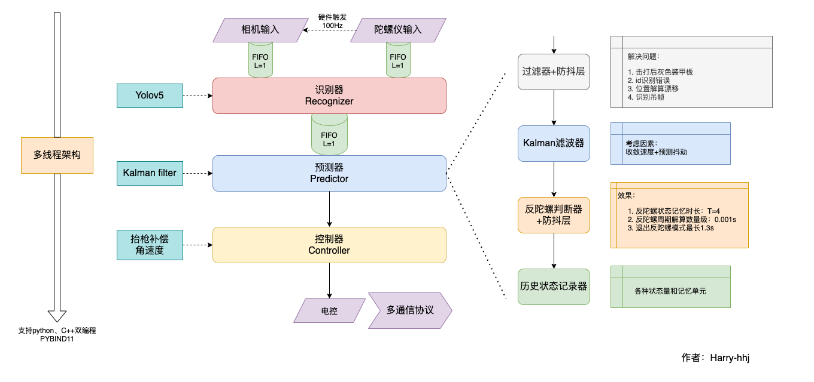
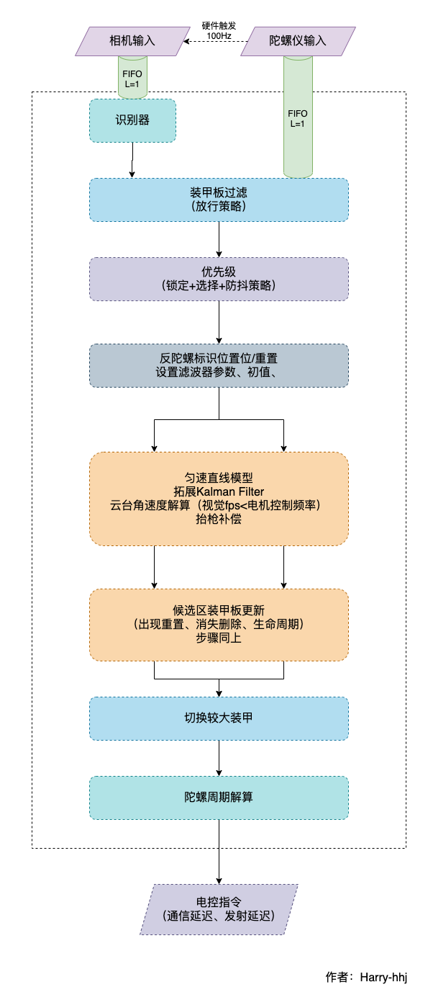

# CVRM2021


上海交通大学 RoboMaster 战队 2021 赛季视觉代码框架。

---


>   本教程的写法主要面向视觉小白和新人队伍，将详细讲述技术点、使用方法和原理。希望战队们在开源时也能够将每一个技术点讲透，方便技术交流。受限于时间原因，部分内容将以后进行补充。


项目依赖：

* CUDA
* TensorRT
* gcc/g++-11：升级方式：添加 ppa 升级
* fmt：建议[编译安装](https://github.com/fmtlib/fmt.git)
* Ceres-Solver：计算库，安装方式：[编译安装](https://github.com/ceres-solver/ceres-solver)
* OpenCV4：计算机视觉库，安装方式：[编译安装](https://github.com/opencv/opencv.git)
* OpenCV_contrib：OpenCV 额外模块，安装方式：和 OpenCV 一起[编译安装](https://github.com/opencv/opencv_contrib.git)
* pybind11：cpp 和 python 互通库，安装方式：```sudo pip install pybind11[global]```
* python3：版本需要大于或等于 3.6 ，可以使用 Miniconda ，也可以使用系统自带
* flask：python 包，用于提供调试网站界面，安装方式：```pip install flask```

---

更新记录：

* 2021-1-25: 降低对 python 版本的要求，不再需要 python3.8 ，现在只要有 python3.6 即可。

TODO：opencv 安装教程将另外发布。

<br>

排坑指南：

-   尽量不要使用 Anaconda 而使用 MiniConda，最好是用系统自带的 Python，毕竟 NX 只是个部署运算平台，不需要多个环境。如果一定要安装 AnaConda 库，那么注意其中的 libtiff 库和 OpenCV 中的 libtiff 版本不对应，会发生 `对‘TIFFReadDirectory@LIBTIFF_4.0’未定义的引用` 等错误，解决方法如[教程](https://www.cnblogs.com/leoking01/p/8306935.html)，或者编译安装，或者删除系统的 tiff 库。
-   gcc/g++-11：本项目中如果 gcc/g++ 版本不对，那么会出现以下几个错误
    -   `autoaim/detector/TRTModule.hpp:83` 中 filesystem 报错，解决方法：更改文件读入方式
    -   `autoaim/detector/TRTModule.hpp:17-18` 中 default 定义错误，解决方法：自己写重载函数


# 简介

我们的哨兵在本赛季采用了双云台的设计，其中上云台沿 roll 旋转了 90 度方便反导。

战略定位：

-   上云台：进攻，协同防守
-   下云台：防守为主

如果有些队伍只有一个云台，那么我建议以防守为主，至少不可以猛烈的进攻，非有效地进攻的发弹量应控制在 5%-10% 。如果哨兵没有子弹了，那么情况就危险了。

功能：

-   反击：预测+反陀螺
-   能量机关：未部署
-   吊射：未实现
-   反导

硬件：

-   NX：自带 CUDA + TRT 。由于没有找一款 USB 3.0 的滑环，我们的上下云台采用了两个 Jetson NX 运算平台，两个运算平台相互独立，之间的信息传递通过电控通信解决
-   camera-imu：MindVision 相机+自研陀螺仪板
-   USB 转 TTL：实现和电控的通信
-   USB 3.0 拓展坞：NX 只有两个 USB 接口，而我们需要三个，因此需要拓展坞

策略：

-   根据战队战术自行制定


# 代码框架

```txt
.
├── CMakeLists.txt：开启了ccahe加速编译，只重新编译修改部分，默认开启编译优化选项
├── README.assets；存放 README.md 图片和附件
├── README.md：本文档
├── UltraMultiThread：umt框架自带，多线程架构
├── asset
│   ├── MV-SUA133GC.Config：相机参数文件，一般修改曝光和增益，仅在程序启动时一次加载
│   ├── autoaim-param.yml：自瞄参数文件，前一半是预测参数，一般无需修改，后一半是反陀螺参数，还没有仔细试过
│   ├── camera-param.yml：相机标定文件，通过 calibrate.py 任务生成
│   ├── model-opt-3.onnx：模型文件
│   ├── model-opt-4.cache：使用的模型文件的cache缓存，如果第一次使用，会自动生成，在 nx 上的时间约为半小时
│   └──model-opt-4.onnx：模型文件：本赛季使用
├── auto_run.sh：自启动脚本
├── autoaim：自瞄相关
│   ├── CMakeLists.txt
│   ├── FindTensorRT.cmake
│   ├── autoaim.cpp：主文件，主要用于定义任务函数并设置后台线程带起，具体见文件
│   ├── autoaim.hpp
│   ├── detector：识别器相关
│   │   ├── TRTModule.cpp：一般修改分类个数需要修改三处地方，在文件中已经注释
│   │   └── TRTModule.hpp
│   └── predictor：预测器相关
│       ├── AdaptiveEKF.hpp：EKF 类底层实现
│       ├── PredictorAdaptiveEKF.cpp：EKF 预测器
│       ├── PredictorAdaptiveEKF.h
│       ├── PredictorKalman.cpp：普通 Kalman 滤波器
│       ├── PredictorKalman.h
│       └── kalman.h: Kalman底层实现
├── build：编译目录
├── common：工具函数
├── core_io：I/O相关
│   ├── CMakeLists.txt
│   ├── ExtImu：陀螺仪相关
│   │   ├── ExtImu.cpp
│   │   └── ExtImu.hpp
│   ├── MindVision：相机相关
│   │   ├── MVSDK
│   │   │   ├── CameraApi.h
│   │   │   ├── CameraDefine.h
│   │   │   └── CameraStatus.h：报错的时候可以查看的文档，找到对应的序号
│   │   ├── MindVision.cpp
│   │   └── MindVision.hpp
│   ├── robot.cpp：通信协议发送接收函数定义
│   ├── robot.hpp：通信协议定义
│   ├── sensors.cpp：相机陀螺仪部分
│   ├── sensors.hpp
│   └── serial：serial库
├── data：数据存储部分
├── example：umt 示例代码，主要讲解了 Publisher 和 Subscriber ，以及 C++ 类注册进 Python 的过程
├── main.cpp：主函数入口，此文件不需要修改
├── record：录视频相关
│   ├── CMakeLists.txt
│   └── record.cpp
└── script：python 脚本，用来启动相应的线程（任务）
    ├── app.py：网页
    ├── autoaim.py：自瞄
    ├── bridge.py：网页
    ├── record.py：录视频
    ├── robot_io.py：通信
    ├── sensors_io.py：相机陀螺仪
    └── templates
```


# 项目介绍



## 发布订阅机制

不同功能之间的通信是通过发布者-订阅者的形式进行的。一种高级多态，即订阅者和发布者之间相互不关心实现方式。可以协调不同速度的线程的同步关系，又可以采取多线程加速，更重要的是可以分离 CPU 任务和 GPU 任务，提高代码并行度。


## camera-imu 传感器系统

视觉的输入来源有两个，一个是 MindVision 的相机，读入的是图片和时间戳，图片初始大小 1280x768 ，时间戳单位 ns ，另一个是 LpSensor 的陀螺仪，读入的数据有很多，详细见文件，目前用到的数据是陀螺仪的四元数，顺序 wxyz 。陀螺仪以固定的周期，如 100 Hz 向相机发送触发信号，相机每受到一次都会拍摄一副图片，因此这两个同一时刻的数据是有对应关系的，这就会涉及到时间同步，这个在 TODO 中会详细说明。因此，需要注意到，如果相机设置的曝光时间（实际上还应该考虑相机内部硬件处理时间）大于了触发周期，那么将会有触发信号被忽略，不建议发生这样的事，应同时降低触发频率。

位置：`core_io/sensor.hpp\cpp`


## camera-imu 联合标定

需要将陀螺仪坐标系和相机坐标系进行标定，来确定相机坐标系的转动量。可以参考的外参标定方法如下：

1.   相机与IMU之间相对旋转角的标定
2.   标定完成之后进行初始化
3.   相机与IMU之间相对平移量的标定
4.   把标定量也当做待估计的状态放入联合优化中

将标定结果放入 `asset/camera-param.yml` 中。


## 双通信协议

先不管视觉是如何计算数据的，当视觉有控制指令的时候，需要通过合适的协议告诉电控，再由电控控制实际的电机运动。同样，视觉也需要通过电控了解裁判系统的各种信息和状态量，因此与电控之间的数据交互是非常重要的。视觉和电控的通信方式只有一种，通过串口通信，但实际的实现分为两种，一种是通过 USB 接入 TTL 模块，变化为 4pin 线接入主控板 uart （电控的电脑），或者是通过运算平台的 4pin 口直接接入电控的 4pin uart 口，实现通信。可能有人会问，直接的数据传输而已，称得上通信吗？实际上，除了数据传输的数据包结构定义（数据的到达先后）外，还需要有冗余的数据位来判断本次的数据包是否有效。举个例子，数据的 bit 在传输过程中因为电磁干扰发生了变化，比如 1 传输成了 0 ，那么这次的数据就该被丢弃，哪怕你认为几乎没有这样的可能性发生（实际上不可避免），在端口的电平变化始终是存在的，如何判断此时是否发生了数据传输？对于此，我们采取了首尾字节来定义一个数据包的开始和结束，并采用较为简单的数据校验方式 LRC ，即数据包的所有字节相加为校验位。注意这种方式只能探测到奇数位的同位 bit 跳变（看不懂就理解成一部分的错误情况），且无法在不重传的情况下实现自动纠正功能（感兴趣可以了解汉明码等）。更为复杂但更有效的校验方式是 CRC 校验。

之所以使用双通信协议，是因为总的通信带宽是有限的，比如 115200 比特率，意味着 1s 只能发送或接收 115200 个比特，也就是说，超过这一数据量就会发生数据丢失或重叠。为了让带宽资源更有效的传输数据，一些不需要实时性状态位可以更新得慢一些，不需要随着程序 fps 的提升而提升，而一些必须每次指令携带的标志位则需要高速更新，它随着程序 fps 的提升而同比例增长，再考虑到每次需要传输的数据位数，这一资源是十分紧张的。实现的方式是，不同的数据包采用不同的首尾数据位，当接收到对应的数据位时，开始接收对应字节的数据量，然后解析、验证。

当数据发生错位时（一般都是因为主控板的各种原因造成数据丢失），不断接收数据直到遇到起始位，然后再配合 LRC 校验，能确保恢复正常。

位置：`core_io/robot.hpp\cpp`


## 延迟测量

从视觉决定执行一个行动到目标机构实际开始执行此行为时，中间是有一个时间差的，这个时间差不容忽视，它和电控控制电机（毕竟他收到的是一个对他来说的历史指令）和视觉的预测时间（这样的延迟会让目标运动多少）。

### 发射延迟

从拨盘转动到实际发出一颗子弹，之间的延迟叫做发射延迟。这一延迟和子弹到达摩操轮所受到的阻力和路程大小有关。按照机械的说法，下供弹的延迟量不会超过 120 ms，实际测试过程中我们也不需要真的测量准这个量，根据子弹超前滞后的关系调整就行了。没有经验建议采用二分法。

### 电控延迟

从电控发送电机转动指令，到电机实际转动的时间差，叫做电控延迟。根据电控的测试，这一延迟量非常微小，为个位数（ms）。

### 通信延迟

这是一个比较重要的延迟量，因为还涉及到控制。从视觉发送指令，到电控发送电机转动指令之间的延迟，叫做通信延迟。这意味着，不仅视觉的预测需要考虑这样的延迟，而且由于视觉指令是增量式的，电控在接收到视觉指令时应当使用此延迟之前的电机的角度加上视觉要求的转动角度，不然在电机快速移动情况下就会出现震荡的现象，原因可以自己直观思考一下。

而这个问题，在视觉和电控同步时间戳，并使用同一块陀螺仪之后，就消失了。首先，视觉指令对应的时刻是已知的，电控只需要取对应时刻的电机数据加上指令形成目标角度即可，注意这在目前是无法实现的，因为不同 CPU 的时间戳是不同的。其次，同一块陀螺仪意味着视觉可以发送绝对角度，那么刚刚的问题也可以被消除了。

这一点会在 TODO 中详细说明。





## 坐标系变换

项目中涉及的坐标系有图像（像素）坐标系、相机坐标系、陀螺仪坐标系、枪管坐标系、世界坐标系，可能还会涉及到装甲板坐标系。弄清坐标变换需要线性代数和刚体力学的知识。

数学推导公式由于是一个数学问题而非技术问题，这里就省略了。


## 四点模型

传统视觉对于定位四个点在多数情况下比神经网络更精确，但是神经网络的模型鲁棒性更强，可以适应不同的场地和曝光。如何集成这两个优势打造一个强大的模型呢？因此，我们基于 yolov5 开发设计了四点模型，网络的输出是：四个点的坐标+class+confidence。

此模型的优势在于：

-   适应不同环境和曝光：在比赛场地几乎不需要调参，心情愉悦，鲁棒性强
-   能够直接给出装甲板的数字，做车辆区分，便于决策层
-   能够部分抗遮挡，在装甲板部分不可见，尤其是一个甚至两个灯条不可见时进行识别，增大识别成功率

此模型的劣势在于：

-   一旦更改标签图案将使整个模型失效
-   数据集制作困难且样本少，导致过拟合、无识别等问题
-   部分战队不情愿更换传统视觉

为此，我们开源了 cpp 版 TRT 推导模型，并直接给出了哨兵本赛季的最终模型和备用模型。这两个模型虽然还有优化空间，但配合代码中的防抖层已经完全可用，效果不输于传统模型。我们鼓励新的战队或在识别上遇到困难的战队将我们的模型作为一种尝试，我们也会根据研发情况决定是否定时公开 baseline 模型供大家使用；而对于视觉强队，我们欢迎任何形式的技术交流，一起探索神经网络的正确打开方式。

欢迎大家与我们共同制作数据集，维护 RM 数据集社区，我们的数据集标注软件[仓库](https://github.com/xinyang-go/LabelRoboMaster.git)（尚在开发中）。

TODO：四点模型 python 教程将队内另外发布，暂不开源。


## 自瞄优先级

有操作手的地面车辆，自瞄优先级一般定义为：
```text
初始化：图像最中心的装甲板
预测：上一次击打的装甲板 > 同 id 装甲板 > 重置预测器
```

对于无人机，自瞄优先级暂时定义为：
```text
初始化：图像最中心的装甲板 或 指定 id 的装甲板
预测：同 id 装甲板 > 重置预测器（1.5s后）
```

对于没有操作手的车辆，自瞄优先级更为复杂，定义为：
```text
初始化：最近的一块装甲板（图像中最大）
预测：优先级 id 逆转 = 斩杀线 > 上一次击打的装甲板 > 同 id 装甲板 > 重置预测器
```
而对于双云台兵种，优先级如下：
```text
初始化：另一个云台更高优先级的协作目标 > 最近的一块装甲板（图像中最大）
预测：另一个云台更高优先级的协作目标 > 优先级 id 逆转 = 斩杀线 > 上一次击打的装甲板 > 同 id 装甲板 > 重置预测器
```
对于反陀螺，将会在反陀螺中详细说。


## python 任务

每一个多线程任务将被封装在一个 background 函数 中，然后此函数会通过 PYBIND11 注册进 python 库中，在 python 中以任务的方式调用执行。此方式和 umt 框架密切相关，详细请看 example 中的示例和教程。

之所以 pybind 不采用导出 .so 文件，而采用内嵌 python 解释器的方法是为了便于在线 debug 。当不输入任何任务文件时，程序将进入 python 终端，可以在程序运行时编写调试代码。

而将 python 和 cpp 互通的原因是：python 编程方便，而 cpp 效率高。所以算法相关代码写在 cpp 中，而调试辅助功能写在 python 里。


## 网页调参

目的就是为了三个：方便、方便、方便：

1.   摆脱对显示器和vnc的需求（因为之前vnc有时死活配不好）
2.   网页不访问则不占 cpu 资源，与窗口显示不同，窗口需要一直刷新占用 cpu 资源。只能上场前手动关闭窗口刷新，而网页则没有这个麻烦。

目前的网页搭建是比较简陋的，如果对于这方面感兴趣或有基础并愿意下赛季与我们共同开发的伙伴，请联系我。目前的设想是希望通过 React 搭建，功能有待胡思乱想。（如果能够模块化开发算法后直接在网页上搭建连接流程运行就很棒）


## 拓展卡尔曼滤波 EKF

拓展 Kalman 滤波是一个很不错的滤波器，想要知道具体的原理请看相关的论文。它击打匀速运动的物体有较高的命中率，同时更新速度也不是很慢。其核心的思想是：用观测值来更新预测值，类似于形成一个闭环的反馈，通过设置预测量和观测量的协方差矩阵（类似于噪声，虽然这么说不严谨），让预测器不会超前和滞后。

我们使用 EKF 而非传统 Kalman 模型的理由是：解藕观测变量，消除变量间的相关性。相机解算出的观测量其实是 yaw 和 pitch 的相对值。传统 Kalman 模型的一个限制条件就是：系统是一个线性系统，而定义一个 yaw 和 pitch 匀角速运动的车辆显然不符合实际的物理模型（意味着车在一个球面上运动），而实际的运动情况是，受制于电机和惯性，车辆在较长时间内都近似匀速直线运动，而这个模型是定义在世界坐标系中的（相机坐标系会有自身的转动，不可取），意味着从观测量（yaw、pitch）到预测量（虽然最终转换成 yaw 、 pitch ，但本质是 xyz ）是一个非线性系统，为了避免观测量之间的噪声相互叠加损害预测器的工作，我们使用了 EKF ，它最大的优势是可以运用于非线性系统。这样，预测将会更加准确且收敛更快。

TODO：EKF 原理教程将另外发布。


## 防抖层

这是一个没有技术的算法代码，但其对于模型误识别和云台快速转动下的物体坐标漂移有很好的消除作用。读懂这段代码对逻辑有一定考验（即比较费脑，还容易忘），并需要对实际作战和需要解决的问题有足够的思考。

### 第一层：双阈值

上一次存在过装甲板的图像区域或世界中的附近区域的装甲板置信度提升，即阈值降低。

### 第二层：颜色

装甲板被击打后将会熄灭，因此灰色的装甲板是需要考虑的。因此，放行条件：上一次击打的装甲板的同号灰色装甲板在车辆存在血量时放行。

### 第三层：误识别

分为多种情况：

-   上一次击打的装甲板作为本次击打的最高优先级，不考虑其 id ，而只考虑图像位置和世界坐标位置匹配：避免 id 抖动
-   上一次击打的装甲板不是 2 号，则本次 2 号装甲板放行：避免 id 抖动（这个模型存在 2 和 3 无识别的情况）

### 第四层：buffer

为了避免电控裁判系统出错而击打死车，设置 buffer 值：每放行一块灰色装甲板，buffer 加 1 。当 buffer 为 `dead_buffer_max_size` 时，不再允许放行灰色装甲板。清空条件：本次未识别到装甲板或切换了一个 id 的装甲板。

### 第五层：关系约束

在云台快速转动的时候，会有车辆世界坐标的漂移问题（这在 TODO 中有说明原因）。由于反陀螺对于新旧装甲板的一一对应关系有着严格的要求，而且我并不希望因为误识别 id 或其他车辆设计等原因导致每次只能看到两块装甲板的假设发生错误，我加入了多个装甲板的约束关系，这在车辆没有转得“起飞”的情况下将长期有效（对帧率是有一定要求的，当然不高，不然错过了这些转化的时刻就无效了），仅在装甲板无法匹配时才生效：

-   上次看到一个装甲板而这次看到两个装甲板，那么按照陀螺自旋方向，上一次的装甲板对应这次两块装甲板的后一块
-   上次看到一个装甲板而这次看到一个装甲板，那么就是对应同一块（除非你的帧率大于T/4）
-   上次看到两个装甲板而这次看到一个装甲板，那么按照陀螺自旋方向，上一次的后一块装甲板对应这次的装甲板，并判断是否切枪
-   上次看到两个装甲板而这次看到两个装甲板，那么按照左右关系相互对应

这五层反映在代码中都是一些 bool 变量和 if 判断，


## 反陀螺

由于没有时间调参，目前所使用的反陀螺是保底版的反陀螺，其思路是：通过赋予候选装甲板一个相对于目前击打装甲板反向的速度，让云台回过头却又不会超出车辆的范围，然后被更新时不断往回走，中间会有一段时间和装甲板同向运动，击中一梭子。

实际上，本套反陀螺设计的思路是：我们先假设对于目前这块装甲板已经拟合出了一个正确的值，那么对于下一块装甲板，使用该值作为初值进行拟合应该能获得更快的收敛速度。对于一个静止的陀螺，它应该有更快的收敛速度和更高的精度，而对于一个平移的陀螺，由于装甲板信息是一块一块继承下去的，相比于一个定义的陀螺模型，它的收敛速度应该更快。但是，应当指出，这种反陀螺思路将耗费大量时间调参，且需要对所用预测的效果有非常清晰的认识。

如果不希望花大量时间调参的，或是对反陀螺命中率要求不高的（大概50%），那么我推荐你这么做：

1.   在反陀螺模式下，调整预测器参数使其更接近于一条直线（即更新减慢）
2.   限制 y 轴（纵向）速度或给予下一块装甲板一个远离的比例速度：在实际击打过程中，我们可以发现，y 轴的运动对与云台的运动要求并不高，即使有偏差也是可以打中的，但 x 轴不一样，x的落后和超前将导致瞄边（对于哨兵和高射速兵种此现象非常明显，因为抬枪补偿量和预测时间小）
3.   观察切换装甲板时 x 轴（横向）的速度，如果已经飘出了车辆范围的，有两种方法：
     1.   给予下一块装甲板反向的比例速度，即本次比赛我们的使用方案
     2.   给予时间衰减因子，陀螺周期我们已知，那么根据陀螺周期给 $x_v$ 一个矫正函数，这个函数甚至是可以推导出的（绘制 x 速度收敛曲线，与理论曲线推导），这个方案没有试过，不过要知道，在快速陀螺的情况下，在击打范围即切枪逻辑的控制下，使用大概方向对的，即使稍微超前落后都能击中
4.   此方案与陀螺转速无太大关系，对于高速陀螺有相似的命中率


# 删除部分

删除了哨兵自动反陀螺逻辑，如想使用最简单的方法从电控接收指令。如果有没删干净的地方请自行修正。

TODO 一章已删除。


# 使用方式

由于上下云台共用一个代码仓库，需要修改的部分仅仅只是参数，所以在不同云台同步代码时有些固定部分是需要修改的，为以下几个部分：

- asset/camera-param.yml
- asset/autoaim-param.yml
- script/sensors_io.py

每个需要改的地方都用注释写明了旧云台、上云台和下云台。

比赛之前修改 `auto_run.sh` 中的 python 任务，加入 `record.py` ，其他时候不需要就关掉。

注意：*.cache文件是每个平台上独有的，不要上传覆盖


## 自启动

能够自动登陆的系统，如 agx 、 nx 可以通过 Ubuntu 自带的 `Startup Applications` 软件启动，命令为 `gnone-terminal-x -c /bin/bash <path/to/script>` （机器上都有），其中前半部分是为了打开一个新的终端用来显示程序输出。


## 调整曝光

修改 `MV-SUA133GC.Config` 中的 `exp_time` 和 `user_exposure_time` 即可（搜索关键字），单位 `ns` ，更新为一样的。


## 自瞄调参

修改 `asset/autoaim-param.yml` 中的预测： `Q00 - Q44` 以及 `R00 - R22` 和反陀螺： `Q00_AC - Q44_AC` 以及 `R00_AC - R22_AC` ，其中 `Q` 对应预测值的协方差矩阵对角线，`R` 对应观测值的协方差矩阵对角线，值和实际的物理量的对应关系如下：
```text
Q00 -> 预测量 x ：用于调整对直线模型中 x 轴方向运动属于直线运动的的置信度，一般预测不用调整
Q11 -> 预测量 x_v ：用于调整 x 轴速度的波动量，减小效果：击打匀速目标不会一会超前一会落后，增大效果：更新速度快，例如变向
Q22 -> 预测量 y ：用于调整对直线模型中 y 轴方向运动属于直线运动的的置信度，一般预测不用调整
Q33 -> 预测量 y_v ：用于调整 y 轴速度的波动量，减小效果：击打匀速目标不会一会超前一会落后，增大效果：更新速度快，例如变向；y 轴（pitch）一般不用调整，很容易打中
Q44 -> 预测量 z ：用于调整对直线模型中 z 轴不变的置信度

R00 -> 观测量 yaw：固定不动
R11 -> 观测量 pitch：固定不动
R22 -> 观测量 distance：用于调整距离的波动大小，一般距离的波动非常大，调成三位数，距离更新快

*_AC -> 对应反陀螺模式下的参数，物理意义相同
```


### 调参技巧

一般固定一组参数，比如 `R` ，调整 `Q` ， `Q00` 和 `Q22` 一起调， `Q11` 和 `Q33` ，一般每对相同， `Q44` 单独调。需要发子弹看效果。

如果遇到落点一直超前或落后（不是震荡或非震荡引起），调整发射延迟。


# SSH 免密登陆使用方法

每次 ssh 登陆设备的时候，都需要输密码，这非常麻烦，一种技巧就是使用公钥登陆，并将自己的公钥放入目标设备的信任主机中，这样每次就能直接登陆了：
```bash
ssh-copy-id -i ~/.ssh/id_rsa.pub <auth@ip>
```


# Clion 远程登陆使用方法

在本机中编写的代码如何同步到目标设备上去呢？我们可以通过 IDE Clion 来帮忙，它能够记录本地文件至少 24 小时内的变动记录，并将改动的文件自动上传。

TODO：Clion 远程开发教程将另外发布。


# 假设模型

## 预测
我们假设车辆在较短的时间内的运动都是匀速直线运动模型，模型公式如下：

其中 z 轴假设不变，之后也可以尝试改成变的，对爬坡可能有帮助。

预测的详细讲解在 `autoaim/predictor/PredictorAdaptiveEKF.cpp` 中，整个逻辑用 `///` 注释，使用 IDE 可以突出显示，也是我们本次开源的**主要部分**之一。


## 反陀螺
用当前装甲板的信息来初始化下一块击打的装甲板，如果设置良好能够帮助预测更好（不一定更准）地拟合，目的就是提高命中率。 Kalman 的初始值对拟合速度有很大的影响，因此可以通过设置该值来调整拟合速度（甚至可以调整慢，只要最终能够达到同样的值，那么中间的连续变化会有一段时间是正确的）。当然这种调参非常困难，因此保底版的方法是让云台和装甲板尽可能同幅度同向运动，那么命中率也能提高，但这就不是真的反陀螺了，而速度继承还是有可能成为真的反陀螺的，只是预测模型是否合适，或者预测器是否合适还需要考证。


## 能量机关
根据下赛季能量机关规则设计。


# TODO

此部分涉及下赛季我战队发展方向，暂不开源。


# 最后的话

我们希望打造一个共同研究的 RM 社区，也希望这个社区能够拥有以下特点：

1.   不固守于旧技术，随时代而发展
2.   有庞大的技术底蕴，在各方面探索创新
3.   有完整的文档支持以及丰富的教程
4.   对新来者友好

为此，我们开源了四点训练模型供大家评判，开源了预测部分代码提供新的思路，开源了反陀螺代码向大家展示一种尝试，开源了项目框架供需要的队伍研究。我们欢迎与任何符合 RM 精神的战队进行技术交流，也乐意向新手队伍提供更多的帮助和指导，帮助其快速成长。在赛场上，RM 就是一个争夺冠军的残酷战场，但是在平时，我希望 RM 就是我们一群人一起玩的地方。

如果您对于技术教程同样感兴趣，欢迎与我联系。

好了，话不多说，我们明年再剑！


<br>

如果您觉得本项目有用的请点一个 Star ！：）

注：本篇教程有一些笔者可能搞错的地方，请以批判的眼光看待，敬请斧正！

---

作者：Harry-hhj，GitHub主页：[传送门](https://github.com/Harry-hhj)

日期：2021-8-31

